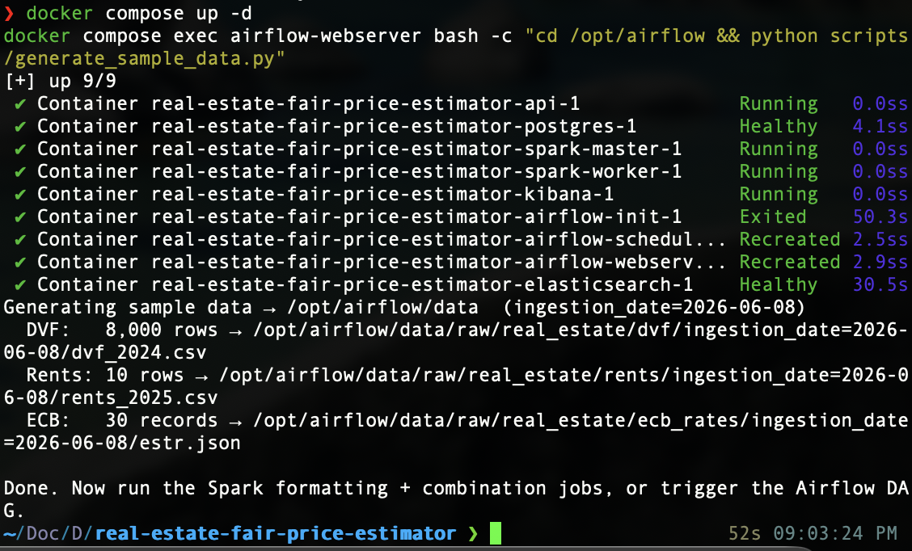
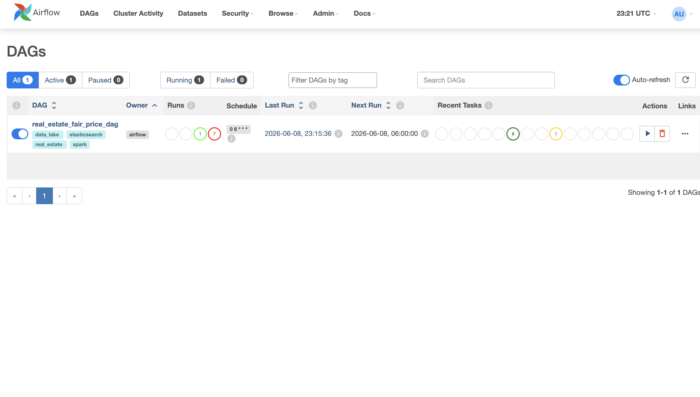
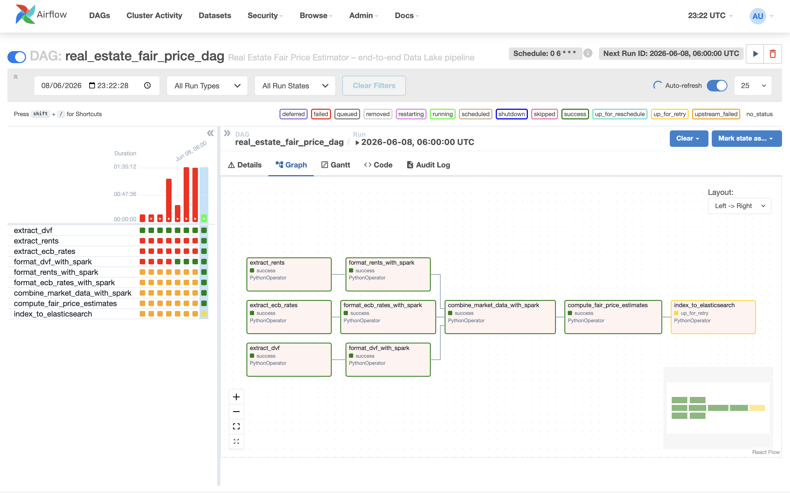
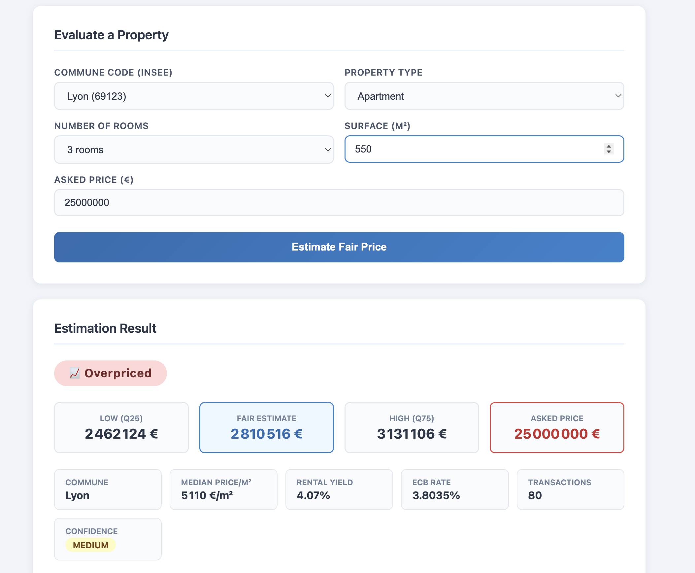

# How It Works — Architecture & Pipeline

## Screenshots

### Stack running


### Airflow — DAG overview


### Airflow — Pipeline graph


### UI — Estimation result


---

This document explains the internal architecture of the Real Estate Fair Price Estimator: where the data comes from, how it flows through the system, and how the fair price is calculated.

---

## Overview

The system is a **batch Big Data pipeline** built on a three-layer Data Lake architecture. It runs on a schedule (or on demand), downloads fresh property data from French government sources, processes it with Apache Spark, and serves the results through a FastAPI web interface.

```
data.gouv.fr (DVF)  ──┐
data.gouv.fr (Rents) ─┼─► Airflow DAG ──► Spark ──► Data Lake ──► FastAPI ──► UI
ECB Data Portal      ──┘
```

---

## Data Sources

| Source | What it contains | URL |
|---|---|---|
| **DVF** (Demandes de Valeurs Foncières) | Every property sale recorded in France since 2019 | files.data.gouv.fr/geo-dvf |
| **Carte des Loyers** (ANIL) | Rent indicators per m² by commune, updated annually | data.gouv.fr |
| **ECB ESTR** | Euro Short-Term Rate — reflects current borrowing conditions | data-api.ecb.europa.eu |

The pipeline currently covers **Île-de-France** (departments 75, 92, 93, 94) for years 2022–2024, covering communes like Paris, Lyon, Nantes, Marseille, Boulogne-Billancourt, Nanterre, Aubervilliers, Saint-Denis, Créteil and Ivry-sur-Seine.

---

## Data Lake Architecture

Data is stored in three layers on the local filesystem, each in **Parquet format** partitioned by date.

```
data/
├── raw/                          ← Layer 1: original files, never modified
│   ├── real_estate/dvf/          ← DVF CSV files partitioned by ingestion_date
│   ├── real_estate/rents/        ← Rent CSV files
│   └── real_estate/ecb_rates/    ← ECB JSON files
│
├── formatted/                    ← Layer 2: cleaned, typed, standardised
│   ├── real_estate/sales/        ← Parquet, partitioned by year
│   ├── real_estate/rents/        ← Parquet, partitioned by source_year
│   └── real_estate/rates/        ← Parquet, partitioned by rate_date
│
└── usage/                        ← Layer 3: aggregated, ready for the API
    └── real_estate/
        └── fair_price_estimates/ ← 100 market segments, partitioned by computation_date
```

Each layer serves a specific purpose:
- **Raw** — immutable archive of source files. You can always re-run processing from here.
- **Formatted** — Spark has cleaned column names, cast types, filtered nulls, and standardised formats.
- **Usage** — pre-aggregated market statistics joined across all three sources, ready to serve instantly.

---

## Airflow Pipeline

The DAG `real_estate_fair_price_dag` runs daily at 6:00 AM and has 9 tasks:

```
extract_dvf ──────────────────────────────────┐
extract_rents ──► format_rents_with_spark ───► combine_market_data_with_spark
extract_ecb_rates ──► format_ecb_rates_with_spark ──► compute_fair_price_estimates ──► index_to_elasticsearch
                  └──► format_dvf_with_spark ─────────────────────────────────────┘
```

### Task descriptions

| Task | What it does |
|---|---|
| `extract_dvf` | Downloads DVF CSV files from data.gouv.fr for each department and year |
| `extract_rents` | Downloads apartment and house rent indicators from the ANIL dataset |
| `extract_ecb_rates` | Fetches the latest ESTR rate from the ECB Data Portal API |
| `format_dvf_with_spark` | Cleans raw DVF data: normalises column names, casts price/surface to float, filters out non-residential sales |
| `format_rents_with_spark` | Renames columns, converts comma decimals, pads commune codes to 5 digits |
| `format_ecb_rates_with_spark` | Parses ECB JSON, extracts rate values and dates |
| `combine_market_data_with_spark` | Joins sales + rents + rates on commune_code, groups by commune/type/rooms, computes market statistics |
| `compute_fair_price_estimates` | Adds fair price confidence level, gross rental yield, and labels to each market segment |
| `index_to_elasticsearch` | Bulk-indexes the 100 market segments into Elasticsearch for Kibana dashboards |

---

## Fair Price Calculation

For each **market segment** (commune × property type × rooms):

1. Collect all historical sale prices per m² from DVF
2. Compute: `median`, `Q25` (25th percentile), `Q75` (75th percentile)
3. Fair price range = `[Q25 × surface_m2, Q75 × surface_m2]`

**Verdict logic:**
```
asked_price < Q25 × surface   →  UNDERPRICED   📉
Q25 × surface ≤ asked ≤ Q75   →  FAIRLY PRICED ✅
asked_price > Q75 × surface   →  OVERPRICED    📈
```

**Confidence levels:**
```
transaction_count < 30    →  LOW
30 ≤ count < 100          →  MEDIUM
count ≥ 100               →  HIGH
```

**Gross rental yield** is also computed:
```
yield = (rent_m2 × 12) / median_price_m2
```

This lets you assess whether the property makes sense as a rental investment relative to the current ECB rate.

---

## API

The FastAPI app exposes three endpoints:

| Endpoint | Method | Description |
|---|---|---|
| `/` | GET | HTML interface |
| `/communes` | GET | List all communes with market data |
| `/estimate` | POST | Classify a property and return fair price range |
| `/market/{commune_code}` | GET | Full market profile for a commune |
| `/docs` | GET | Interactive Swagger UI |

The API reads from the usage layer (Parquet) when running locally, and falls back to a pre-exported `api/data.json` snapshot when deployed on Render.

---

## Services

When you run `docker compose up -d`, six services start:

| Service | Port | Purpose |
|---|---|---|
| **airflow-webserver** | 8080 | DAG monitoring and manual triggers |
| **airflow-scheduler** | — | Executes DAG tasks on schedule |
| **postgres** | — | Airflow metadata database |
| **api** | 8000 | FastAPI — serves the UI and estimates |
| **elasticsearch** | 9200 | Stores indexed market segments |
| **kibana** | 5601 | Visualisation dashboard for market data |

Spark runs in **local mode** (`local[*]`) directly inside the Airflow container — no separate Spark cluster needed.

---

## Running the Pipeline Manually

Instead of waiting for the scheduled Airflow run, you can trigger each step directly:

```bash
# 1. Fetch real data
docker compose exec airflow-webserver bash -c "cd /opt/airflow && python jobs/ingestion/extract_dvf.py"
docker compose exec airflow-webserver bash -c "cd /opt/airflow && python jobs/ingestion/extract_rents.py"
docker compose exec airflow-webserver bash -c "cd /opt/airflow && python jobs/ingestion/extract_ecb_rates.py"

# 2. Format with Spark
docker compose exec airflow-webserver bash -c "cd /opt/airflow && python jobs/formatting/format_dvf_spark.py"
docker compose exec airflow-webserver bash -c "cd /opt/airflow && python jobs/formatting/format_rents_spark.py"
docker compose exec airflow-webserver bash -c "cd /opt/airflow && python jobs/formatting/format_ecb_rates_spark.py"

# 3. Combine and compute
docker compose exec airflow-webserver bash -c "cd /opt/airflow && python jobs/combination/combine_market_data_spark.py"
docker compose exec airflow-webserver bash -c "cd /opt/airflow && python jobs/combination/compute_fair_price_estimates.py"
```

Then open **http://localhost:8000** to query the results.

---

## Quick Test (no real downloads)

To test the full pipeline without downloading gigabytes of DVF data:

```bash
docker compose exec airflow-webserver bash -c "cd /opt/airflow && python scripts/generate_sample_data.py"
```

This generates 8,000 synthetic property transactions across 10 French communes in under 1 second. The pipeline then runs identically to the real-data path.
